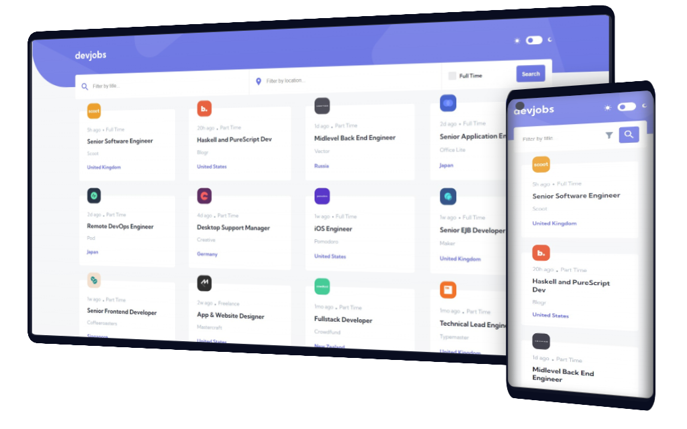

<h1 align="center">Hi 👋, We are CodeReactOrNext</h1>
<h3 align="center">A passionate team of frontend developers from Poland</h3>
<h3 align="center">This is our first project: Devjobs Web App</h3>

<h3 align="left">Used Languages and Tools:</h3>

          

- [Overview](#overview)
  - [Link](#link)
  - [Screenshot](#screenshot)
  - [What we have learned](#what-we-have-learned)
  - [Built with](#built-with)
  - [Authors](#authors)

## Overview

### Link

[Devjobs App Live Link](https://devjobs-web-app-livid.vercel.app/)

### Screenshot

### What we have learned

- Gitflow
- Using Git and GitHub as a team in Agile methodology
- Page routing using React Router
- Dark mode with state stored to local storage

### Built with

- Semantic HTML5 markup
- Flexbox
- CSS Grid
- Mobile-first workflow
- [React](https://reactjs.org/) - JS library
- [Styled Components](https://styled-components.com/) - For styles

### Authors

- [DevmianS](https://github.com/DevmianS)
- [Michaljapko](https://github.com/Michaljapko)
- [mpoweredo](https://github.com/mpoweredo)
